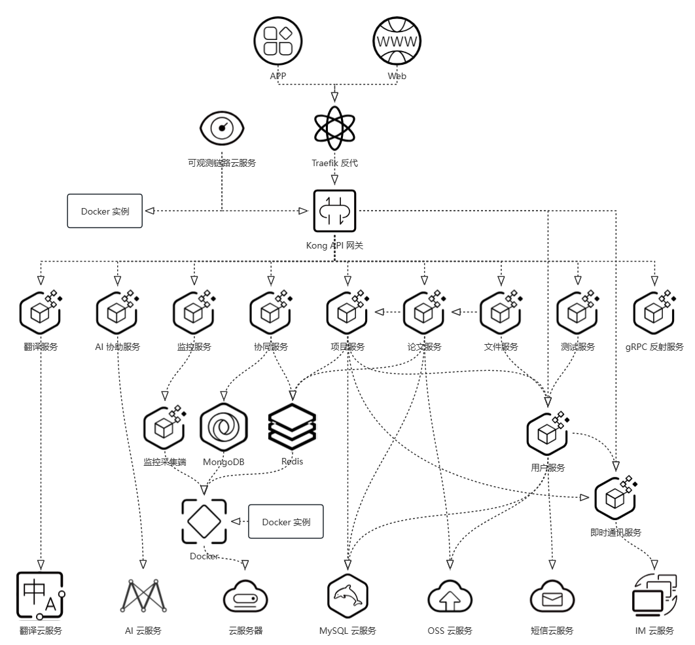

# PaperPilot 后端

<!-- markdownlint-disable-next-line MD036 -->
_✨ Author: [Nagico](https://github.com/Nagico/) ✨_

  
  
   
  
  
  
  
   

<!-- markdownlint-enable MD033 -->

## 服务介绍

### 项目微服务

微服务间通过 gRPC 通信，目前项目自行创建的微服务有：

| 服务 ID | 服务名 | 服务介绍 |
| :----: | :----: | :----: |
| ai | [AI 协助服务](./paperpilot-backend-ai) | 通过 AI 协助翻译、解析与总结 |
| coordinator | [协同服务](./paperpilot-backend-coordinator) | 提供接口用于项目、论文协同操作 |
| file | [文件服务](./paperpilot-backend-file) | 为 OSS 提供文件相关操作 http 回调接口 |
| im | [即时通讯服务](./paperpilot-backend-im) | 为项目、论文更新等团队操作提供实时消息推送 |
| monitor | [监控服务](./paperpilot-backend-monitor) | 提供接口用于获取各个服务的状态 |
| monitor-client | [监控采集端](./paperpilot-backend-monitor-client) | 收集各个容器状态为监控服务提供基础数据 |
| paper | [论文服务](./paperpilot-backend-paper) | 论文创建、修改、删除，自动获取论文数据 |
| project | [项目服务](./paperpilot-backend-project) | 项目创建、修改、删除，管理项目成员，提供 web 邀请网页 |
| reflection | [gRPC 反射服务](./paperpilot-backend-reflection) | 提供标准 gRPC 反射接口，返回公开接口信息 |
| test | [测试服务](./paperpilot-backend-test) | 接口测试、获取当前登录用户信息 |
| translation | [翻译服务](./paperpilot-backend-translation) | 提供翻译接口用于论文阅读 |
| user | [用户服务](./paperpilot-backend-user) | 用户注册、登录、信息修改 |

### 第三方服务

项目还采用了第三方服务：

| 服务名 | 使用方式 | 服务介绍 |
| :----: | :----: | :----: |
| [对象存储 OSS](https://www.aliyun.com/product/oss) | 云服务 | 资源文件存储 |
| [云数据库 RDS](https://www.aliyun.com/product/rds) | 云服务 | 持久化数据存储 |
| [云服务器 ECS](https://www.aliyun.com/product/ecs) | 云服务 | 项目部署 |
| [短信服务](https://www.aliyun.com/product/sms) | 云服务 | 验证码发送 |
| [MongoDB](https://www.mongodb.com/) | 独立部署 | 协同数据存储 |
| [Redis](https://redis.io/) | 独立部署 | 缓存、部分数据临时存储 |
| [OpenAI GPT](https://platform.openai.com/docs/guides/gpt) | 云服务 | AI 协助基础服务 |
| [百度翻译](https://fanyi-api.baidu.com/) | 云服务 | 用于翻译服务 |
| [即时通信 IM](https://cloud.tencent.com/document/product/269) | 云服务 | 消息推送基础服务 |
| [Kong](https://konghq.com/) | 独立部署 | API 管理、鉴权、限流 |
| [Traefik](https://traefik.io/) | 独立部署 | 域名及证书管理 |
| [可观测链路 OpenTelemetry 版](https://www.aliyun.com/product/developerservices/xtrace) | 云服务 | 微服务链路监控 |

### 服务部署

服务部署采用 Docker 容器化部署，使用 Docker Compose 管理容器。目前有 2 台服务器，基于 Github Actions 实现自动化部署。

